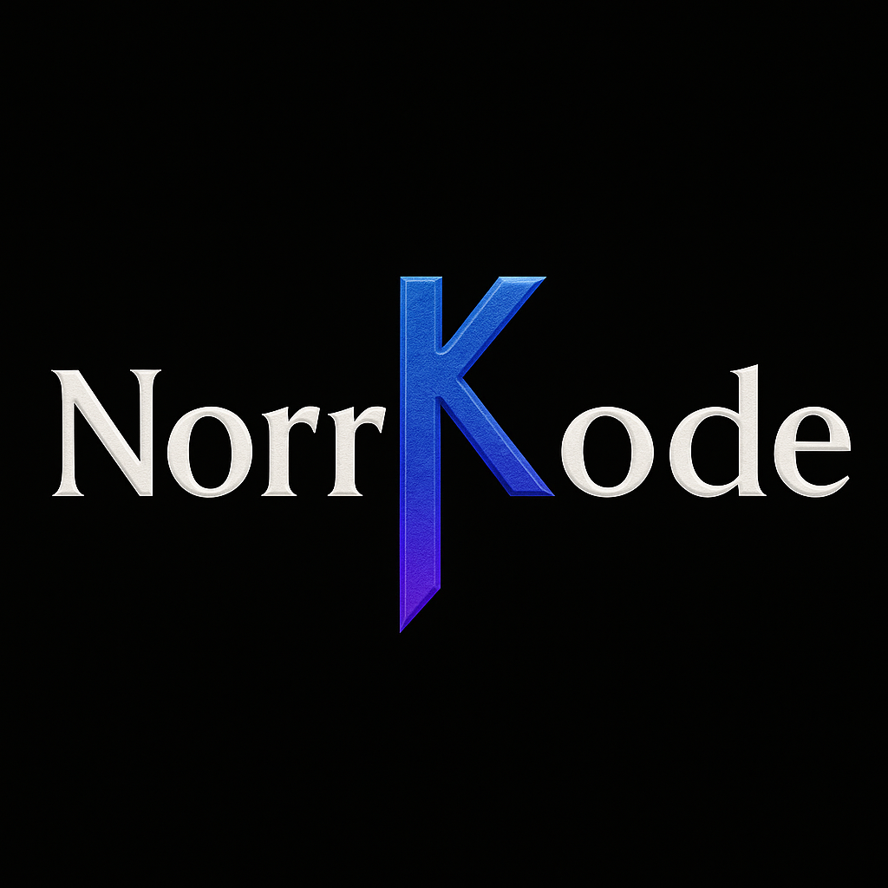

# NorrKode · Branding, Web & Campañas Digitales



Sitio oficial de **NorrKode**, estudio creativo/tecnológico orientado a negocios locales:  
branding, desarrollo web y campañas digitales enfocadas en resultados.

- 🌐 **Live:** https://noorkode.netlify.app/  👉 (cámbialo si usas dominio propio)
- 📩 **Contacto rápido:** WhatsApp con CTA desde la landing

---

## ✨ Características

- **Landing enfocada a conversión**: CTA visible en hero y footer.
- **Caso real** (captación de personal) como prueba social inicial.
- **SEO básico**: `<title>`, `meta description`, OG/Twitter Cards.
- **Accesibilidad**: labels ocultos (`.sr-only`), contraste y navegación simple.
- **Rendimiento**: imágenes optimizadas y carga ligera.

---

## 🧱 Tech Stack

- HTML5 + CSS3 (vanilla)
- JavaScript (vanilla)
- [Font Awesome 6](https://cdnjs.com/libraries/font-awesome)
- Fuente: Poppins (Google Fonts) 👉 *(si se usa)*
- Sin frameworks ni build step (deploy estático)

---

## 📁 Estructura del proyecto

NorrKode/
├─ assets/
│ ├─ fonts/
│ │ └─ RUNE.TTF
│ ├─ img/
│ │ └─ runas.png
│ └─ og/
│ └─ norrkode-og.jpg ← Open Graph (1200×630)
├─ css/
│ └─ styles.css
├─ app.js
├─ gracias.html
└─ index.html


---

## 🚀 Ejecutar en local

**Opción A (VS Code)**: extensión **Live Server** → “Open with Live Server”.

**Opción B (sin extensiones)**, desde la raíz del proyecto:

```bash
# con Node
npx serve -s .git

# o con Python 3
python -m http.server 5501

---

## 📦 Deploy (Netlify)

1. Crea cuenta en Netlify → **Add new site → Import from Git**.  
2. Conecta tu repo de GitHub y elige `NorrKode`.  
3. Build command: *(vacío, es sitio estático)*.  
   Publish directory: `/`.  
4. Deploy. Obtendrás un dominio tipo `https://norrkode.netlify.app/`.  
5. Si más adelante compras un dominio propio, lo apuntas en **Domain settings**.

---

## ✅ Roadmap corto

- [ ] Crear favicon con la **K rúnica** (32×32 y 192×192).  
- [ ] Agregar un **caso real** (captación de promotores) en la sección Portafolio.  
- [ ] Botón WhatsApp con mensaje precargado (`?text=`).  
- [ ] Pixel de Meta y eventos de clic en CTA (para métricas).

---

## © Licencia

Contenido y diseño © 2025 **NorrKode**.  
Todos los derechos reservados.

